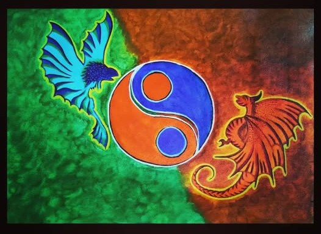
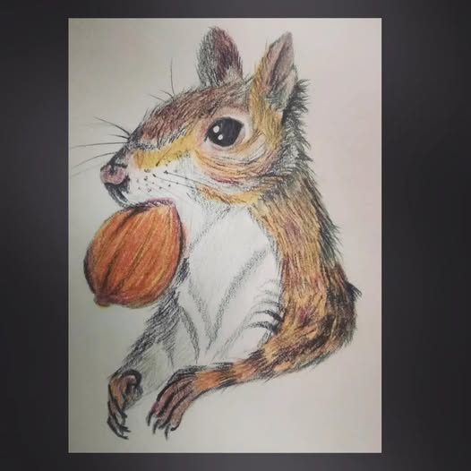
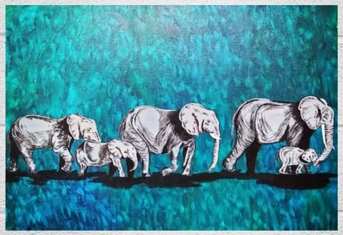

<!-- HEADER BANNER -->
<h1 align="center">✨ Hi, I'm <strong>Laasya Vajjala</strong> ✨</h1>
<h3 align="center">AI Research Technologist • AI/ML Engineer • Artist</h3>

<!-- BADGES -->

  
  
  

---

# 👩‍🔬 **About Me**

I’m an **AI Research Technologist at Washington State University**, working on **Assessing GHG Emission Reduction Potential of Covered Lagoons in the Northwest**.  

---

- 🧪 **AI Research Technologist @ WSU (Biological Systems Engineering)** — working with Dr. **Shulin Chen** on methane mitigation & decision tooling for covered lagoons. [GHG Lagoon Mini Demo](https://github.com/Laasya-online/ghg-lagoon-mini-demo)
- 🗣️ **Advisor, Indian Students Association @ WSU** — campus community building, large-scale cultural collaborations, crisis ops & mentorship (3 years).  
- 🎤 **Recent**: Presented my covered-lagoon GHG work at the **2025 WSU Plant Science Symposium**; showcased research at the [**Northwest Bioenergy Summit**](https://www.linkedin.com/posts/laasya-vajjala-884b43172_wsu-plantscience-agritech-activity-7396400535966433282-j_R1?utm_source=share&utm_medium=member_desktop&rcm=ACoAACkagSQBL9q7Vec6lKMo6UIrQG4UtLUyxew)  
- ☁️ **Now learning**: GenAI foundations + **Snowflake** architecture, governance, and data apps. 

---

# ⚙️ **Tech Stack**

### **Programming & Scripting**

### **AI/ML Tools**

### **Platforms & Cloud**

### **Data**

### **Dev Tools & Frameworks**

---

# 🚀 **Featured Work**

## 🔥 Highlights

> Two-minute skim: these are the repos I want you to open first.

### 1) JD Analyzer — GenAI + Data
LLM-powered job-description analysis → **strict JSON** (top languages, top skills, biggest skill gap) with validation, charts, and a 1-slide summary.  

[→ Repo](https://github.com/Laasya-online/JD-analyzer-genai) 

---

### 2) Zero-to-Snowflake — Modern data platform
Hands-on SQL journey through databases, schemas, roles, warehouses, and the semantic layer; builds intuition for **governance**, **cost control**, and **analytics-ready marts**.  
**Stack:** Snowflake SQL, RBAC, task automation, analytics schemas  

[→ Repo](https://github.com/Laasya-online/zero-to-snowflake)

---

### 3) Network Security — LSTM Irregularity Detection
Time-series anomaly detection with **LSTM** to surface suspicious network behavior; clean data pipeline, metrics, and reproducible results.  
**Stack:** Python, PyTorch/TensorFlow, scikit-learn, pandas, matplotlib  

[→ Repo](https://github.com/Laasya-online/CPT_S-534-Neural-Network-Design-and-Applications)

---

## 🌤️ Vibe Panel

- 📖 **Book:** *The Secret* — Rhonda Byrne  
- ❄️ **Weather:** Winter
- 🎨 **Color:** Navy
- 🎬 **Favorite Worlds:** Attack On Titans • Black Clover 

---

## 🎨 My Art Corner
I paint to relax my brain after debugging. 

  
  
  
   
  

